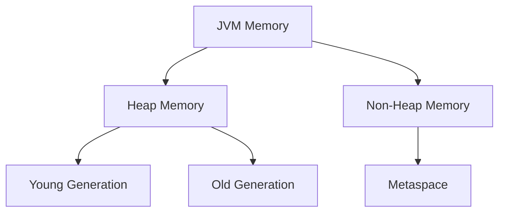

# Lucee Configuration Guide

## Server Configuration

### Web Administrator Interface

<div class="admin-access" markdown>
!!! tip "Quick Access"
    Access the Lucee Web Administrator at: `http://your-domain:8888/lucee/admin/web.cfm`
</div>

### Configuration Files

=== "lucee-server.xml"
    ```xml
    <?xml version="1.0" encoding="UTF-8"?>
    <lucee-configuration>
        <setting>
            <name>requestTimeout</name>
            <value>0,0,0,50</value>
        </setting>
    </lucee-configuration>
    ```

=== "Application.cfc"
    ```cfml
    component {
        this.name = "MyApp";
        this.sessionManagement = true;
        this.sessionTimeout = createTimeSpan(0,0,30,0);
    }
    ```

## Performance Settings

| Setting | Default | Recommended | Description |
|---------|---------|-------------|-------------|
| Scope Cascading | strict | strict | Defines variable scope resolution |
| Template Cache | true | true | Caches compiled templates |
| Query Cache | false | true | Caches database queries |

## Memory Management



### Memory Settings

```properties
# JVM Settings
-Xms512m      # Initial Heap Size
-Xmx2048m     # Maximum Heap Size
-XX:MaxMetaspaceSize=256m
```

## Security Configuration

### Sandbox Security

<div class="security-grid" markdown>

<div class="security-card" markdown>
#### File System
- Read/Write permissions
- Directory restrictions
- File type limitations
</div>

<div class="security-card" markdown>
#### Network Access
- IP restrictions
- Port limitations
- Protocol controls
</div>

</div>

## Datasource Setup

```sql
-- Example Database Configuration
CREATE DATABASE myapp;
CREATE USER myapp_user WITH PASSWORD 'secure_password';
GRANT ALL PRIVILEGES ON DATABASE myapp TO myapp_user;
```

### Connection Settings

```yaml
datasource:
  name: MyAppDS
  class: org.postgresql.Driver
  url: jdbc:postgresql://localhost:5432/myapp
  username: myapp_user
```

## Mail Server Configuration

<div class="mail-config" markdown>
```properties
mail.server=smtp.example.com
mail.port=587
mail.username=user@example.com
mail.password=******
mail.tls=true
```
</div>

## Logging & Debugging

### Log Levels

<div class="log-levels" markdown>
- <span style="color: #FF0000;">ERROR</span> - Critical issues
- <span style="color: #FFA500;">WARN</span> - Warning messages
- <span style="color: #0000FF;">INFO</span> - Information messages
- <span style="color: #808080;">DEBUG</span> - Debug information
</div>

### Debug Settings

```cfml
<cfset application.debugEnabled = true>
<cfset application.debugIPRange = "192.168.1.*">
```

## Environment Variables

<div class="env-table" markdown>
| Variable | Purpose | Example |
|----------|---------|---------|
| LUCEE_HOME | Installation directory | /opt/lucee |
| JAVA_HOME | Java installation | /usr/lib/jvm/java-11 |
| PATH | System path | ${LUCEE_HOME}/bin |
</div>

## Custom Extensions

### Installing Extensions

```bash
# Extension Installation Command
box install commandbox-cfconfig
```

### Extension Configuration

```json
{
  "extensions": {
    "pdf": {
      "provider": "Adobe",
      "license": "XXXX-XXXX-XXXX"
    }
  }
}
```

<style>
/* Grid Layouts */
.security-grid {
    display: grid;
    grid-template-columns: repeat(auto-fit, minmax(250px, 1fr));
    gap: 1rem;
    margin: 2rem 0;
}

.security-card {
    padding: 1rem;
    background: var(--md-code-bg-color);
    border-radius: 0.5rem;
    border: 1px solid var(--md-primary-fg-color--light);
}

/* Tables */
.env-table table {
    width: 100%;
    margin: 1rem 0;
}

/* Log Levels */
.log-levels {
    background: var(--md-code-bg-color);
    padding: 1rem;
    border-radius: 0.5rem;
    margin: 1rem 0;
}

/* Mail Config */
.mail-config {
    background: var(--md-code-bg-color);
    padding: 1rem;
    border-radius: 0.5rem;
    margin: 1rem 0;
}

/* Admin Access */
.admin-access {
    margin: 2rem 0;
}
</style>
