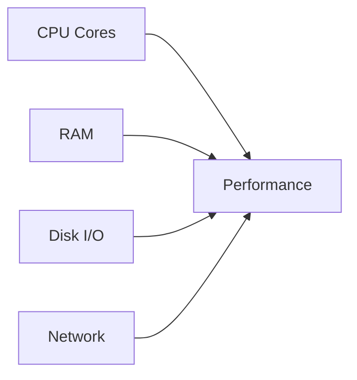
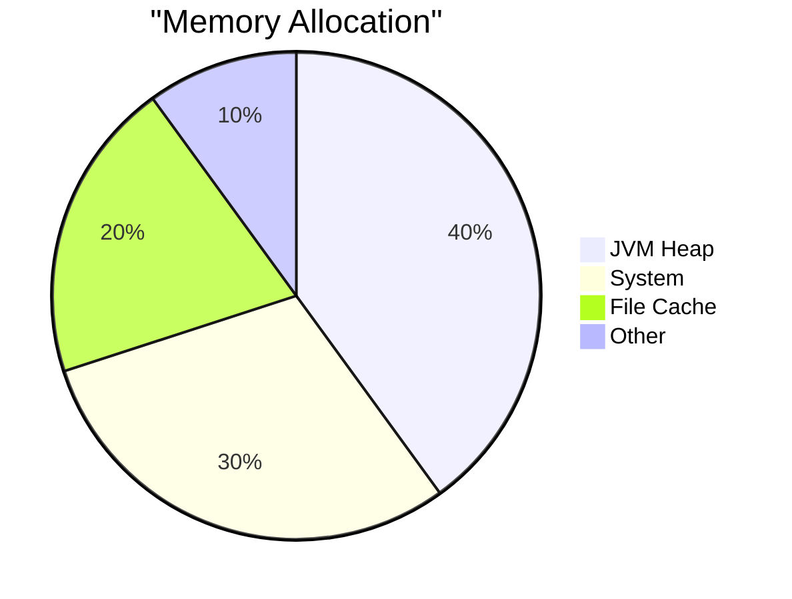
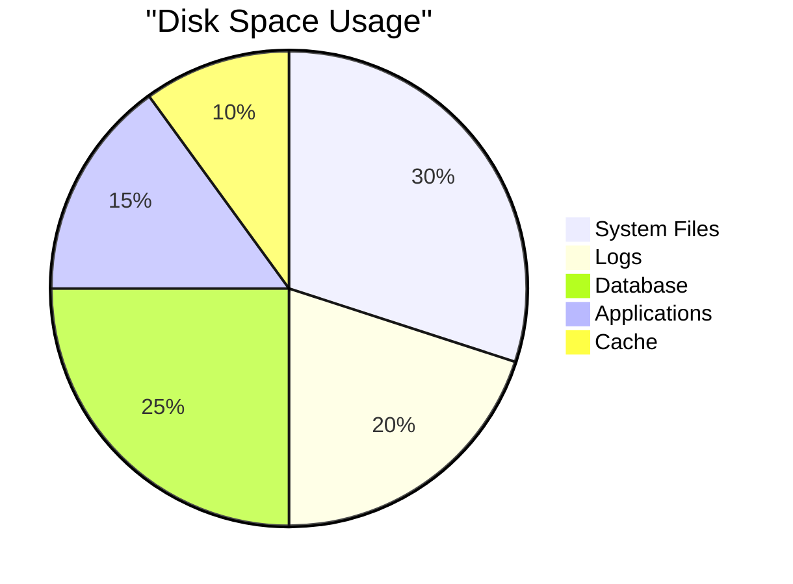
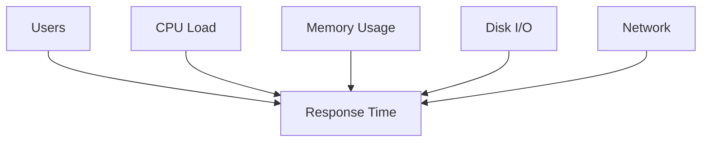

# Hardware Requirements

## Minimum System Requirements

### Minimum Specifications

- CPU: Dual-core processor, 2.0 GHz
- RAM: 2 GB
- Disk Space: 500 MB
- Network: 100 Mbps

## Recommended Specifications

### Recommended for Production

- CPU: Quad-core processor, 3.0+ GHz
- RAM: 8 GB
- Disk Space: 2 GB
- Network: 1 Gbps

## Hardware Performance Chart

## CPU Requirements

### CPU Benchmarks

| Processor Type | Single-Thread Score | Multi-Thread Score | Recommendation |
|---------------|---------------------|-------------------|----------------|
| Entry Level | 2,000 | 8,000 | Development |
| Mid-Range | 2,500 | 15,000 | Small Production |
| High-End | 3,000+ | 25,000+ | Enterprise |

## Memory Configuration

### Memory Distribution

### Memory Recommendations

#### Development
- Minimum: 2 GB RAM
- JVM Heap: 1 GB
- System: 1 GB

#### Production
- Minimum: 8 GB RAM
- JVM Heap: 4 GB
- System: 4 GB

#### Enterprise
- Minimum: 16 GB RAM
- JVM Heap: 8 GB
- System: 8 GB

## Storage Requirements

### Disk Space Allocation

### IOPS Requirements

| Workload | Required IOPS | Storage Type |
|----------|--------------|--------------|
| Development | 100 | SSD |
| Production | 1,000 | NVMe SSD |
| Enterprise | 10,000+ | Enterprise NVMe |

## Network Requirements

### Bandwidth Requirements

#### Internal Network
- Minimum: 100 Mbps
- Recommended: 1 Gbps
- Latency: < 1ms

#### External Network
- Minimum: 10 Mbps
- Recommended: 100 Mbps
- Latency: < 50ms

## Scaling Guidelines

### Vertical Scaling

| Users | CPU Cores | RAM | Storage |
|-------|-----------|-----|---------|
| < 100 | 2 | 4 GB | 20 GB |
| < 1,000 | 4 | 8 GB | 50 GB |
| < 10,000 | 8 | 16 GB | 100 GB |
| 10,000+ | 16+ | 32+ GB | 200+ GB |

### Load Testing Results

