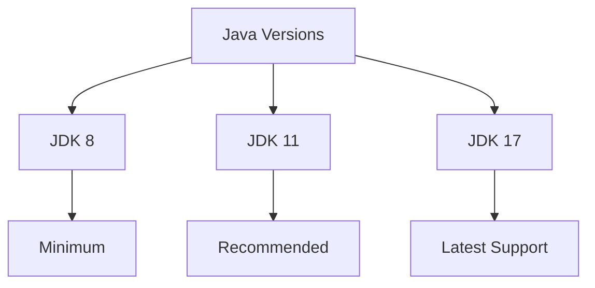
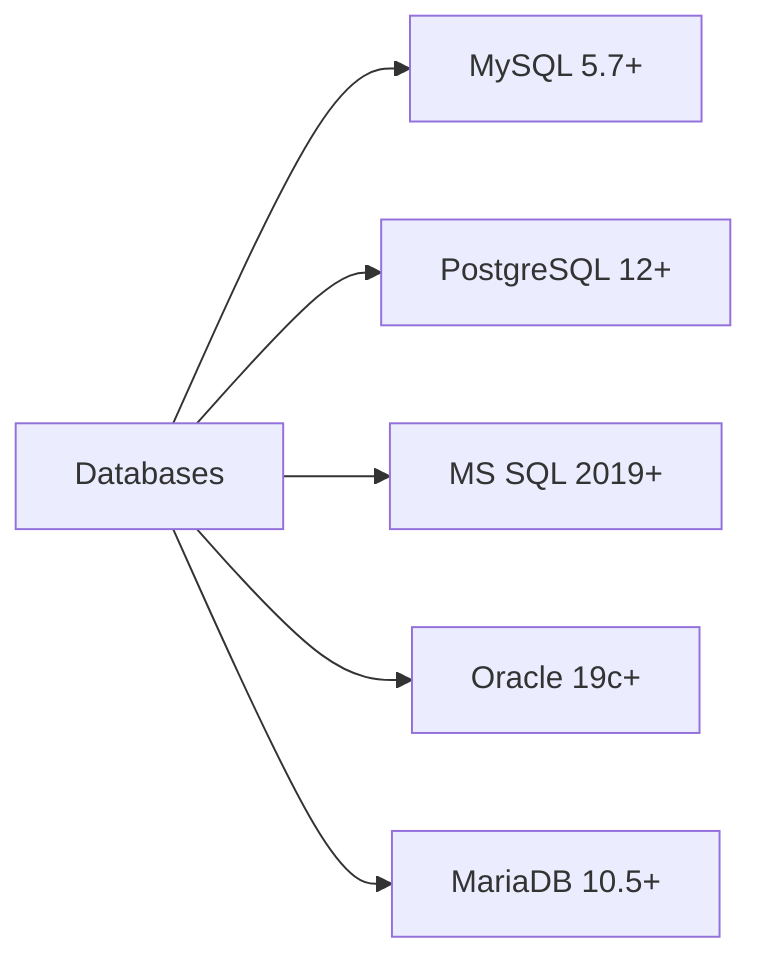

# Software Requirements

## Operating Systems

### Supported Platforms

#### Windows
- Windows 10/11 Pro
- Windows Server 2019
- Windows Server 2022

#### Linux
- Ubuntu 20.04/22.04 LTS
- Red Hat Enterprise 8/9
- CentOS Stream 8/9

#### macOS
- macOS Monterey (12)
- macOS Ventura (13)
- macOS Sonoma (14)

## Java Requirements

### JDK Versions

### Java Distributions

| Distribution | Version | Support Level |
|--------------|---------|---------------|
| Eclipse Temurin | 8, 11, 17 | Full |
| Amazon Corretto | 8, 11, 17 | Full |
| Azul Zulu | 8, 11, 17 | Full |
| Oracle JDK | 8, 11, 17 | Limited |

## Web Servers

### Compatible Servers

#### Apache
- Version: 2.4+
- mod_cfml support
- mod_proxy support

#### Nginx
- Version: 1.18+
- proxy_module
- fastcgi_module

#### Tomcat
- Version: 9.0+
- Built-in support
- Servlet 4.0

## Database Support

### Supported Databases

### JDBC Drivers

| Database | Driver Version | Download Link |
|----------|----------------|---------------|
| MySQL | 8.0.28+ | [Download](https://dev.mysql.com/downloads/connector/j/){ .download-button } |
| PostgreSQL | 42.3+ | [Download](https://jdbc.postgresql.org/download/){ .download-button } |
| MS SQL | 9.4+ | [Download](https://docs.microsoft.com/sql/connect/jdbc/download-microsoft-jdbc-driver-for-sql-server){ .download-button } |

## Additional Software

### Required Tools

#### Build Tools
- Maven 3.6+
- Ant 1.10+
- Git 2.30+

#### Development Tools
- Visual Studio Code
- IntelliJ IDEA
- Eclipse

#### Monitoring Tools
- JMX Console
- New Relic
- Datadog

## Browser Support

### Supported Browsers

| Browser | Minimum Version | Recommended Version |
|---------|----------------|-------------------|
| Chrome | 90+ | Latest |
| Firefox | 88+ | Latest |
| Safari | 14+ | Latest |
| Edge | 90+ | Latest |

## Security Software

### Compatible Security Tools

#### Antivirus
- Windows Defender
- Norton
- McAfee

#### Firewalls
- Windows Firewall
- iptables
- UFW

#### SSL/TLS
- Let's Encrypt
- Commercial SSL
- Self-signed

